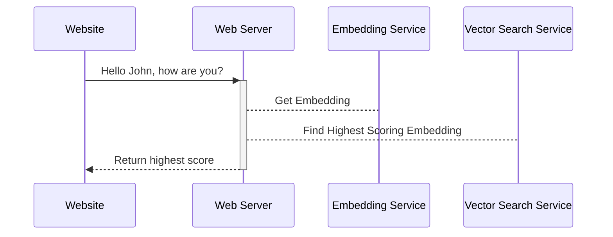
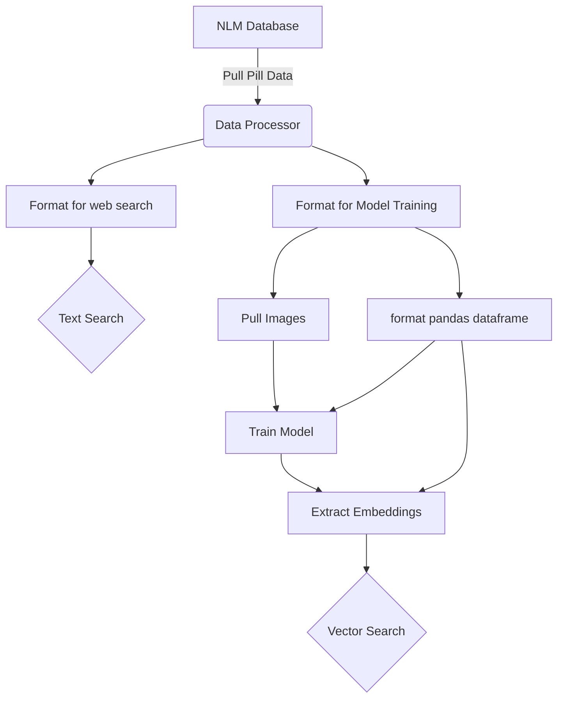

# Pill Picker

### About
VeriPill is an accessible, affordable, easy-to-use technology that patients can use to reduce medication errors by receiving verification on their prescribed medication in seconds.

## RUNTIME DIAGRRAM

## DATA PIPELINE DIAGRAM

