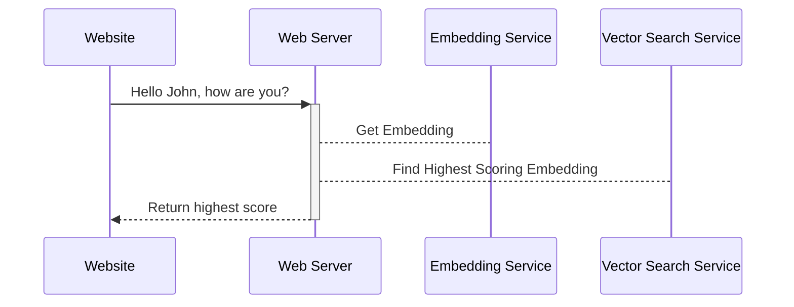

# Pill Picker

```mermaid
sequenceDiagram
    Website->>+Web Server: Hello John, how are you?
    Web Server-->Embedding Service: Get Embedding
    Web Server-->Vector Search Service: Find Highest Scoring Embedding
    Web Server-->>-Website: Return highest score
```
